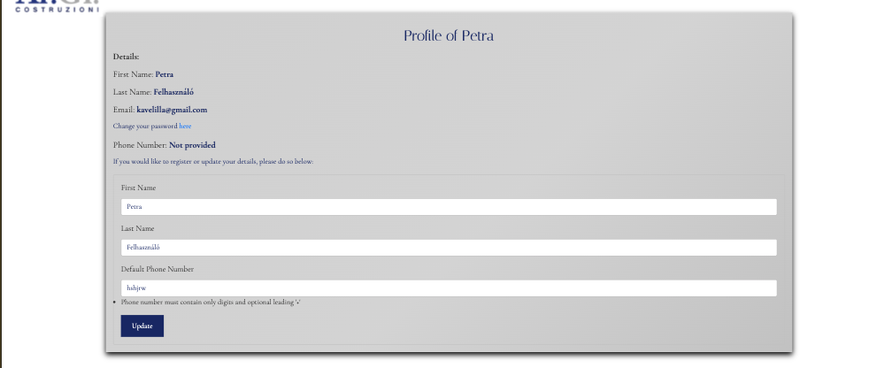
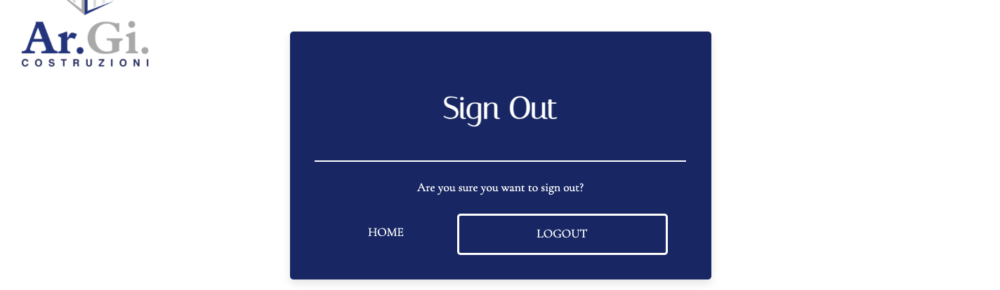

# Residenza 126

Residenza126 is a real estate showcase platform designed for buyers seeking modern, luxurious living spaces in Oristano, Italy. The website provides an elegant and user-friendly experience for exploring available properties within the Residenza 126 project, an exclusive residential complex.

The platform functions as a virtual showroom, allowing users to explore, filter, search and view available apartments securely. Each apartment listing provides detailed information, including floor plans, features, description and images/ videos.

 Registered users can save their favorite apartments for quick access and benefit from personalized recommendations.

Admin users oversee and maintain the property catalog and apartment details, ensuring all listings and specifications are up-to-date. They also have the authority to manage registered users.

Web marketing strategies for Residenza126 focus on organic social media marketing, primarily through Instagram, to engage potential buyers and showcase the project's offerings. 

The platform is built with Django, Python, HTML, Bootstrap, and CSS, ensuring a modern, responsive user experience. It is deployed via Heroku, with PostgreSQL used for database management. Cloudinary is utilized for media storage, and Whitenoise is integrated for efficient static file management.


[Link to the live project](https://www.argicostruzioni.com/)

# Contents

- [User Experience (UX)](https://github.com/Lilla-Kavecsanszki/residenza127#user-experience-ux)
  - [Ideal Client](https://github.com/Lilla-Kavecsanszki/residenza127#ideal-client)
- [User Stories & Epics](https://github.com/Lilla-Kavecsanszki/residenza127#user-stories-and-epics)
- [Planning](https://github.com/Lilla-Kavecsanszki/residenza127#planning)
- [Design](https://github.com/Lilla-Kavecsanszki/residenza127#design)
  - [Wireframes](https://github.com/Lilla-Kavecsanszki/residenza127#wireframes)
  - [Entity Relationship Diagrams](https://github.com/Lilla-Kavecsanszki/residenza127#entity-relationship-diagrams)
  - [Theme](https://github.com/Lilla-Kavecsanszki/residenza127#theme)
  - [Typography](https://github.com/Lilla-Kavecsanszki/residenza127#typography)
- [Languages Used](https://github.com/Lilla-Kavecsanszki/residenza127#languages-used)
- [Frameworks, Libraries, Programs & Technologies Used](https://github.com/Lilla-Kavecsanszki/residenza127#frameworks-libraries-programs--technologies-used)
- [Features](https://github.com/Lilla-Kavecsanszki/residenza127#features)
- [User Story - Features Cross-Reference Table](https://github.com/Lilla-Kavecsanszki/residenza127#user-story---features-cross-reference-table)
- [Deployment](https://github.com/Lilla-Kavecsanszki/residenza127#deployment)
- [Testing](https://github.com/Lilla-Kavecsanszki/residenza127#testing)
  - [Code Validation](https://github.com/Lilla-Kavecsanszki/residenza127#code-validation)
  - [Manual Testing](https://github.com/Lilla-Kavecsanszki/residenza127#manual-testing)
  - [Further Testing](https://github.com/Lilla-Kavecsanszki/residenza127#further-testing)
  - [Bugs](https://github.com/Lilla-Kavecsanszki/residenza127#bugs)
- [Credits](https://github.com/Lilla-Kavecsanszki/residenza127#credits)
  - [Media and Content](https://github.com/Lilla-Kavecsanszki/residenza127#media-and-content)
  - [Acknowledgments and Code](https://github.com/Lilla-Kavecsanszki/residenza127#acknowledgments-and-code)

# User Experience (UX)

### Ideal client

The ideal client for this business is:

-	English-speaking and Italian-speaking individuals
- Individuals seeking modern, high-quality living spaces in a peaceful, private environment
- Those looking for a blend of contemporary architecture and cutting-edge technology in a residential setting
- Investors and homebuyers who value premium finishes and customization options
- People seeking privacy, comfort, and style within a prestigious residential area
- Prospective tenants or buyers looking for a unique living experience in Oristano

Visitors to the **Residenza126** website are seeking:

- A **user-friendly platform** to explore available apartments, with detailed information about their features, floor plans, and customization options.
- A comprehensive overview of the **exclusive amenities** and benefits of living in a modern residential complex like Residenza126, highlighting the combination of contemporary design, peace, and privacy.
- **Personalized services** that cater to individual preferences, including the option to schedule private tours and receive tailored advice for apartment selection.
- A **high-quality, modern living experience** in the heart of Oristano, where luxury meets functionality.
- The ability to access **multilingual content** with both **English** and **Italian** language options, thanks to the **language selector**, ensuring a wider reach for prospective buyers or investors.

This website is the best way to help them achieve these goals because:

- The **intuitive navigation** makes it easy for visitors to explore apartment layouts, amenities, and other details, allowing them to make informed decisions about their new home.
- Detailed **apartment descriptions** include information on **floor plans, finishes, and customization** options, giving users insight into how they can personalize their living spaces to fit their unique needs and style.
- The site highlights **exclusive features** of Residenza126, such as **cutting-edge technological solutions** and premium, sustainable materials that align with the needs of modern, eco-conscious residents.
- The site provides **rich visuals** including **images and floor plans** of the apartments, helping visitors get a clear picture of what life in Residenza126 could be like.
- The **language selector** ensures that the website serves both **English and Italian-speaking** users, catering to an international clientele interested in investing or moving to Oristano.

In summary, **Residenza126** provides a high-end, user-focused experience for those looking for a modern, luxurious, and private living environment in Oristano. With a focus on premium quality, cutting-edge design, and a seamless browsing experience, the website effectively guides users through the process of discovering and learning about the exclusive **Residenza126** project.

[Back to top](https://github.com/Lilla-Kavecsanszki/residenza127#contents)

# User Stories and Epics

## Epic 1: User Management

### US101: User Registration:
**As a new user,** I can register for an account with my email and password so that I can save my preferences and access property details.

#### Acceptance Criteria:
- The registration form must include fields for email and password.
- The email must be unique, and if not, an error message must be shown.
- A confirmation email must be sent upon successful registration.

### US102: User Authentication:
**As a returning user,** I can log in using my existing credentials or log out so that I can access my personal details in a secure way.

#### Acceptance Criteria:
- The login form must include fields for email and password.
- If the credentials are incorrect, an error message should appear.
- The user must be redirected to their profile page upon successful login.

### US103: Receive Verification Email After Registration:
**As a new user,** I can receive an email confirmation after submitting the registration form so that I can verify my email address and complete the registration process.

#### Acceptance Criteria:
- A confirmation email must be sent to the user upon successful registration.
- The email must contain a verification link.
- Clicking the verification link must activate the user's account.

### US104: Personal User Profile:
**As a site user,** I can access my personalized user profile so that I can view my saved properties and preferences.

#### Acceptance Criteria:
- The user must be able to view their profile from the dashboard.
- The profile must display saved properties, preferences, and contact details.
- The user must be able to update their profile details.

## Epic 2: Property Management

### US201: Purpose of Website and Navigation:
**As a site user,** I can quickly understand that the website showcases available apartments for sale, and I can navigate to various sections such as property listings, details, and contact information.

#### Acceptance Criteria:
- The website must have clear navigation links for property listings, contact, and other relevant sections.
- The homepage should clearly indicate that the site lists available apartments.
- Navigation to property listings must be quick and responsive.

### US202: Add New Property Listing:
**As an admin,** I can add new apartment listings to the website so that I can showcase the latest available apartments to prospective buyers.

#### Acceptance Criteria:
- The admin must be able to fill out fields for property details, such as price, location, and description.
- The property listing must be immediately visible on the website after submission.
- The admin must receive a confirmation message upon successfully adding a new listing.

### US203: Update Property Information:
**As an admin,** I can edit property information such as pricing, floor plans, and availability to ensure the website reflects accurate and up-to-date listings.

#### Acceptance Criteria:
- The admin must be able to edit property details.
- Changes must be reflected immediately on the property listing.
- The admin must receive a confirmation message upon updating a listing.

### US204: Delete Property Listing:
**As an admin,** I can remove properties that are no longer available or sold, so that users are not confused by outdated listings.

#### Acceptance Criteria:
- The admin must be able to delete properties from the listings.
- Deleted properties must no longer be visible to users.
- A confirmation message should be shown to the admin after deleting a property.

### US205: View Apartment Listings:
**As a user,** I can view a list of available apartments, so that I can browse and compare different properties.

#### Acceptance Criteria:
- The user must be able to view a list of apartments.
- The list should display basic information like price, location, and size.
- The user must be able to click on each listing to view detailed property information.

### US206: View Detailed Property Information:
**As a user,** I can view detailed information about each property, including floor plans, features, and location, so that I can make an informed decision.

#### Acceptance Criteria:
- The property details page must show comprehensive information about the property.
- Multimedia elements (photos, videos) should be included on the property page.
- The user must be able to contact the admin or agent directly from the property page.

### US207: Search for Properties:
**As a user,** I can search for apartments using keywords or filters (e.g., price, size, location) so that I can quickly find properties that match my criteria.

#### Acceptance Criteria:
- The user must be able to enter keywords or apply filters to search for properties.
- Search results must be displayed in real-time.
- The search results must accurately match the user’s criteria.

### US208: Filter Properties:
**As a user,** I can filter apartments based on different criteria such as price range, number of bedrooms, and location, so that I can narrow down my search to the most relevant properties.

#### Acceptance Criteria:
- The user must be able to apply multiple filters.
- Filtered results must reflect the selected criteria.
- The user should be able to remove or modify filters easily.

### US209: Sort Properties:
**As a user,** I can sort the list of available apartments based on price, size, or other criteria to help me find the best match faster.

#### Acceptance Criteria:
- The user must be able to sort the property list by different criteria.
- Sorting must be responsive and update the listings in real-time.
- The user must be able to toggle between ascending/descending order.

### US210: View Multimedia for Each Property (Property Carousel):
**As a user,** I can view a carousel of images and videos for a property on the property details page, so that I can visually assess the property.

#### Acceptance Criteria:
- The property details page must include a carousel of images and/or videos.
- The user should be able to navigate through the multimedia elements.
- The multimedia must load quickly and be of high quality.

### US211: Handle 404 Error:
**As a user,** if I encounter a broken link or missing property page, I can be redirected back to the homepage or property listings, ensuring a seamless browsing experience.

#### Acceptance Criteria:
- If the user encounters a broken link, a 404 error page must be displayed.
- The 404 page must provide a link back to the homepage or property listings.
- The user must be able to continue browsing the website without disruption.

## Epic 3: Contact and Inquiry Management

### US301: Request Property Information:
**As a user,** I can request additional information about a property via a contact form or inquiry button, so that I can get more details before deciding to schedule a viewing.

#### Acceptance Criteria:
- The user must be able to submit an inquiry through a contact form or inquiry button.
- The inquiry must be sent to the admin or agent.
- The user must receive a confirmation that their inquiry has been submitted.

### US302: Schedule a Property Visit:
**As a user,** I can submit a request to schedule a visit for a specific apartment, and a representative can follow up with available times for a viewing.

#### Acceptance Criteria:
- The user must be able to submit a request to schedule a property visit.
- A confirmation email with proposed viewing times must be sent to the user.
- The request must be visible to the admin for follow-up.

### US303: View Contact Details:
**As a user,** I can view contact details for the real estate agents or property managers so that I can easily reach out with questions or inquiries.

#### Acceptance Criteria:
- Contact details (name, phone, email) must be displayed on the website.
- The contact details must be easily accessible on property pages.
- Users must be able to contact agents directly from the contact details.

### US304: Send Inquiry:
**As a user,** I can send an inquiry about a specific apartment to the admin or agent via email or contact form so that I can get more information or arrange a visit.

#### Acceptance Criteria:
- The user must be able to send an inquiry through a form or email link.
- The admin or agent must receive the inquiry.
- The user must receive a confirmation that their inquiry has been sent.

### US305: Download Brochure:
**As a user,** I can download the latest brochure for Residenza 126, so that I can review all details, floor plans, and pricing offline or share it with others.

#### Acceptance Criteria:
- The user must be able to download the latest brochure in PDF format.
- The download link must be accessible on the property page.
- The brochure must be up-to-date with the latest property details.

## Epic 4: Language and Accessibility

### US401: Language Switch:
**As a user,** I can switch between English and Italian so that I can view the website in my preferred language, improving accessibility and user experience.

#### Acceptance Criteria:
- The website must have a language switcher option.
- The user must be able to switch between English and Italian seamlessly.
- The language switch must affect all website content.

### US402: Display Content in Preferred Language:
**As a user,** I want the website content (such as property listings, navigation, etc.) to display in my selected language, ensuring consistent translation across the site.

#### Acceptance Criteria:
- All website content must be translated consistently when the language is switched.
- Property details must appear in the selected language.
- Language-specific content must be stored and accessible for both languages.

## Epic 5: User Profile Management

### US501: View Profile Details:
**As a registered user,** I can view my personal details such as name, email, and phone number, to stay informed about my profile.

#### Acceptance Criteria:
- The user must be able to view personal details from their profile.
- The profile page must show name, email, and phone number.
- The information must be accurate and up-to-date.

### US502: Update Profile Information:
**As a registered user,** I can update my personal information like name and phone number to keep my profile current.

#### Acceptance Criteria:
- The user must be able to update their personal information.
- The changes must be reflected immediately after saving.
- A confirmation message must be shown upon successful update.

### US503: Change Password:
**As a user,** I can change my password securely to maintain the privacy and security of my account.

#### Acceptance Criteria:
- The user must be able to change their password from the profile settings.
- The new password must meet security criteria.
- The user must receive a confirmation message upon successful password change.

### US504: View Favourites:
**As a user,** I can view a list of properties I have marked as favourites, so that I can easily revisit them later.

#### Acceptance Criteria:
- The user must be able to view a list of favourite properties.
- The list must be updated when the user adds or removes properties from favourites.
- The user must be able to click on a favourite to view the property details.

## Epic 6: Admin Panel and Management

### US601: Admin Dashboard:
**As an admin,** I can access a dashboard to manage properties, users, and inquiries so that I can stay organized and ensure the site operates smoothly.

#### Acceptance Criteria:
- The admin must be able to access a dashboard with an overview of properties, users, and inquiries.
- The dashboard must allow easy navigation between sections.
- The admin must be able to filter and sort data on the dashboard.

### US602: Manage Property Listings:
**As an admin,** I can edit, update, or remove listings through the admin panel to keep the site accurate and up-to-date with available properties.

#### Acceptance Criteria:
- The admin must be able to edit, update, or delete property listings from the panel.
- Changes must be reflected immediately on the site.
- A confirmation message must be shown after making updates.

### US603: Manage User Inquiries:
**As an admin,** I can review and respond to inquiries sent by site users about properties so that I can provide the necessary information to prospective buyers.

#### Acceptance Criteria:
- The admin must be able to view all user inquiries.
- The admin must be able to respond to inquiries through the panel.
- The user must receive a notification when their inquiry is responded to.

## Epic 7: SEO

### US701: SEO Optimization:
**As a site user,** I can easily find the site through web searches, ensuring that prospective buyers can discover the website easily when searching for properties in Oristano.

#### Acceptance Criteria:
- The site must be optimized for search engines with relevant keywords.
- Property pages must be indexed by search engines.
- The site must load quickly to enhance SEO ranking.

### US702: View Privacy Policy:
**As a site user,** I can access and view the company’s privacy policy so that I can understand how my data is handled in compliance with GDPR and other regulations.

#### Acceptance Criteria:
- The privacy policy must be easily accessible from the homepage.
- The policy must be up-to-date and cover data handling practices.
- Users must be able to download or print the policy if needed.

### US703: Contact Support:
**As a user,** I can easily access clear contact information or support options to get help with any issues related to the website or property inquiries.

#### Acceptance Criteria:
- Contact information must be easily accessible from the website.
- The user must be able to submit a support ticket or email.
- The user must receive a confirmation that their support request has been received.

### US704: Leave Reviews and Feedback:
**As a user,** I can leave reviews or feedback about properties I have visited so that I can share my experiences and help others in their decision-making process.

#### Acceptance Criteria:
- The user must be able to leave a review or feedback on property pages.
- Reviews must be submitted and visible to other users immediately.
- The user must be able to rate properties with a star system (e.g., 1-5 stars).

## Epic 8: Construction Projects

### US801: View Construction Projects (Construction Page):
**As a user,** I can view upcoming construction projects, including their descriptions, images, and expected completion dates, so that I can stay informed about future developments.

#### Acceptance Criteria:
- The user must be able to view a list of construction projects.
- Each project must have a description, images, and expected completion dates.
- The user must be able to click on a project to view detailed information.

### US802: Browse Construction Project Details:
**As a user,** I can browse detailed information about each upcoming project, including its location, type of development, and any associated multimedia (images, videos), so that I can better understand future real estate opportunities.

#### Acceptance Criteria:
- Each project page must include location, type, and other relevant details.
- The page must display images and videos about the project.
- The user must be able to return to the project list after viewing a project.

[Back to top](https://github.com/Lilla-Kavecsanszki/residenza127#contents)

# Planning

The planning process for **Residenza 126** began with identifying the ideal clientele for the properties, which involved creating a Persona Profile using Code Institute's template and applying design thinking principles. This Persona Profile helped us better understand the needs, expectations, and preferences of the potential buyers or investors, allowing us to tailor the website experience specifically to them. The website was designed with these user personas in mind, ensuring the presentation and functionality catered to the right audience.

You can view the detailed persona profile [HERE](staticfiles/README_docs/Persona_Template.pdf).

Given the increasing reliance on mobile devices for browsing and searching for properties, designing a responsive and accessible website was a priority. We utilized Bootstrap’s grid system, along with responsive utilities and custom CSS, to ensure that the website provides a seamless experience across various devices, from desktop to mobile, allowing users to explore the Residenza 126 property easily from anywhere.

### Agile Methodology

In this project, I applied an **Agile** approach using **GitHub issues** to create **User Stories**, which were then grouped into **Epics** and **Milestones** in a GitHub Project. This served as the Agile project management tool to track progress and ensure the team remained on course. The development of issues was managed through a **Kanban board**, which helped me track tasks in stages from **To Do** to **Done**.

Currently, all major issues are marked as **'Done,'** except for Epic 8: Construction Projects, which is labeled as **'Could Have'** and **'Won't be Included This Time - Next Sprint'**, according to the **MoSCoW prioritization**. 
This means that the functionality is fully working and set up, but at the moment, it is hidden from the public. Only the admin user can see it, as we are currently waiting on news and content material for the page.

[Back to top](https://github.com/Lilla-Kavecsanszki/residenza127#contents)

# Design

### Wireframes

Wireframes were utilized during the design process, generated with Balsamiq to plan and design the interface layout for different screen sizes.

[Wireframe - Home page](README_docs/home.pdf)

[Wireframe - Authentication pages](README_docs/authentication.pdf)

[Wireframe - Apartment pages](README_docs/product_related.pdf)

[Wireframe - My Profile page](README_docs/my_profile.pdf)

[Wireframe - Property Management page](README_docs/product_management.pdf)

[Wireframe - 404 page](README_docs/404.pdf)

### Entity Relationship Diagrams

# Residenza 126

To support the functionality of the **Residenza 126** website, the following models have been designed and implemented to store essential property, user, and contact-related information in the database.

The **User** table in the ER diagram serves as a conceptual representation only. It does not directly correspond to the models in `models.py` or the actual physical database tables but offers a logical view of how data entities relate to each other. The **User** model handles the management of registered users, including their personal information, preferences, and interactions with properties.

The **Property** and **UserProfile** models are designed to handle the details of the properties available for viewing or purchase and the user profiles, respectively. These models store critical details such as property name, features, location, and user preferences for liked properties.

Additionally, the **Contact** model captures the information submitted by users via the contact form on the website. This model allows users to reach out with inquiries about the properties or any other questions they may have regarding **Residenza 126**. The form data is stored securely, including fields such as name, email address, phone number, message, and the date/time of submission.

The **Entity Relationship Diagrams (ERD)** below illustrate how the models are interconnected, showcasing the relationships between users, properties, user profiles, and contact submissions. This ensures that all relevant data is properly organized and accessible for various website functionalities, such as property browsing, saving favorites, managing user profiles, and handling contact inquiries.

- UserProfile has a one-to-one relationship with User.
- UserProfile has a many-to-many relationship with Property through the liked_properties field.
- Property has a many-to-many relationship with User through the liked_by field.
- Property has one-to-many relationships with PropertyImage and PropertyVideo.
- Contact stands alone without direct relationships to the other models.

The following ER diagrams detail these relationships:

<p>
<details><summary>ER Diagram</summary><br/>

</details>


[Back to top](https://github.com/Lilla-Kavecsanszki/residenza127#contents)

### Theme

- White - #ffffff
- Dark Gray - #a9a9a9
- Goldenrod - #daa520
- Atlantic Navy - #16357
- Fibonacci Blue - #182d5f


The color palette for the Residenza126 website has been carefully selected to reflect the brand's core values of purity, elegance, and natural well-being. It harmoniously blends neutral tones with vibrant accents, conveying a sense of freshness and tranquility that aligns with the nature of the products. The color scheme is designed to highlight key elements for better user engagement and readability while staying true to the aesthetic of the company’s logo.

### Typography

- Cormorant Garamond (Secondary Font for Body and Subheadings):
  - Cormorant Garamond is a serif font that blends modern and classical design elements. Its elegant and readable design makes it perfect for body text and subheadings. This font ensures readability while maintaining a refined and luxurious aesthetic.


- Italiana (Accent Font):
  - Italiana adds a touch of refined elegance with its flowing, cursive style. Used sparingly for emphasis or in specific design elements, it adds a distinctive charm to the overall design while maintaining a sophisticated tone.


- Playfair Display (Navbar Font):
  - Playfair Display is used in the navbar to give the site an elegant, upscale look. Its high contrast and bold characteristics make it stand out in the navigation, enhancing visibility and ensuring a refined aesthetic. The serif details add a touch of sophistication while maintaining clarity, guiding users smoothly through the website's sections.


- Cinzel (Primary Font for Headings):
  - Cinzel is a classic serif font inspired by Roman inscriptions, offering an elegant and timeless look. It adds a touch of sophistication and grandeur to headings and titles, aligning with the brand's focus on natural, luxurious products.


Overall, this combination of fonts creates a harmonious balance between elegance and readability, ensuring that both the body text and headers stand out clearly while maintaining the sophisticated and clean aesthetic of the site. The fonts work together to enhance the user experience and support the brand's identity, providing a visually pleasing and engaging environment.

[Back to top](https://github.com/Lilla-Kavecsanszki/residenza127#contents)

# Languages Used

- HTML5
- Python
- CSS3
- Javascript

[Back to top](https://github.com/Lilla-Kavecsanszki/residenza127#contents)

## Frameworks, Libraries, Programs & Technologies Used

- [**Balsamiq**](https://balsamiq.com/) was used to create the wireframes.
- [**Free Privacy Policy Generator**](https://www.freeprivacypolicy.com/free-privacy-policy-generator/) was used to generate the privacy policy for the website.
- [**Lucid**](https://lucid.app/documents#/documents?folder_id=recent) was used to create the ER diagrams.
- [**Canva**](https://www.canva.com/) was used to create the brochure and contact buttons/links on the homepage.
- [**ColorKit**](https://colorkit.co/palette/ffffff-a9a9a9-daa520-163573-182d5f/) was used to create the website's color palette.
- **GitHub** was used as the repository for the project code after being pushed from Git.
- **Visual Studio Code** was used for version control, allowing me to commit changes and push them to GitHub directly from the VS Code terminal. It was the primary tool used for creating and editing all the code.
- [**Google Fonts**](https://fonts.google.com/) was used to source the fonts for the project.
- [**Font Awesome**](https://fontawesome.com/) was used to add icons for aesthetic and UX purposes.
- [**Favicon**](https://favicon.io/) was used to create the favicon.
- [**Bootstrap**](https://getbootstrap.com/) was used to build a responsive website quickly.
- **Microsoft Word** was used during the design process to sketch out wireframes.
- [**Django**](https://www.djangoproject.com/) was used as the web framework for building the application.
- [**Gunicorn**](https://gunicorn.org/) was used as the web server to run Django on Heroku.
- [**Pillow**](https://pillow.readthedocs.io/en/stable/index.html) - Python Imaging Library, used for image handling.
- [**Django Allauth**](https://django-allauth.readthedocs.io/en/latest/) was used for account registration and authentication.
- [**Django Crispy Forms**](https://django-crispy-forms.readthedocs.io/en/latest/) was used for advanced form rendering.
- [**Cloudinary**](https://cloudinary.com/) was used for storing static files and images, ensuring easy access and management.
- [**Heroku**](https://heroku.com/) was used to deploy the application and provide an environment in which the code can execute.
- [**dj-database-url**](https://pypi.org/project/dj-database-url/) - Used for simplifying database URL configuration.
- [**dj3-cloudinary-storage**](https://pypi.org/project/dj3-cloudinary-storage/) - This is the specific Django package used to connect Django with Cloudinary for static and media storage.
- [**django-cloudinary-storage**](https://pypi.org/project/django-cloudinary-storage/) - Another Cloudinary integration for Django, used for handling media file uploads.
- [**django-phonenumber-field**](https://github.com/stefanfoulis/django-phonenumber-field) - Added to handle phone number fields with international support.
- [**Django Extensions**](https://django-extensions.readthedocs.io/en/latest/) - Provides additional management commands for Django.
- [**SendGrid**](https://sendgrid.com/) - Integrated to send transactional emails via API.
- [**Whitenoise**](https://whitenoise.readthedocs.io/en/latest/) - For serving static files efficiently in production, particularly on Heroku.
- [**ASGI**](https://asgi.readthedocs.io/en/latest/) (asgiref) was used for asynchronous server gateway interface support in Django.
- [**Babel**](https://babel.pocoo.org/en/latest/) - Used to manage internationalization and localization.
- [**Black**](https://black.readthedocs.io/en/stable/) - Python code formatter used to maintain code consistency and style.
- [**Certifi**](https://pypi.org/project/certifi/) - Provides Mozilla’s root certificates for secure HTTPS requests.
- [**CFFI**](https://cffi.readthedocs.io/en/latest/) - Provides a foreign function interface for Python to call C code.
- [**Click**](https://click.palletsprojects.com/en/8.1.x/) - Used for command-line interface creation.
- [**Cryptography**](https://cryptography.io/en/latest/) - A Python library used for secure encryption and cryptographic operations.
- [**Flake8**](https://flake8.pycqa.org/en/latest/) - A Python tool for enforcing coding standards.
- [**IDNA**](https://pypi.org/project/idna/) - For handling internationalized domain names.
- [**Isort**](https://pycqa.github.io/isort/) - A Python tool used to sort imports.
- [**MCCabe**](https://github.com/PyCQA/mccabe) - A complexity checker for Python code.
- [**Mypy Extensions**](https://mypy.readthedocs.io/en/stable/extensions.html) - A library to support optional typing in Python.
- [**Packaging**](https://packaging.pypa.io/en/latest/) - For managing Python package building and distribution.
- [**Pathspec**](https://github.com/cachapa/pathspec) - Used for path matching functionality in Python.
- [**Phonenumbers**](https://github.com/daviddrysdale/python-phonenumbers) - Library for parsing, formatting, and validating phone numbers.
- [**Psycopg2**](https://www.psycopg.org/) - PostgreSQL database adapter for Python.
- [**Pycodestyle**](https://pycodestyle.readthedocs.io/en/latest/) - Python style guide checker.
- [**Pycparser**](https://pypi.org/project/pycparser/) - A library for parsing C code.
- [**Pyflakes**](https://pypi.org/project/pyflakes/) - A fast static code analysis tool for Python.
- [**Python Magic**](https://github.com/ahupp/python-magic) - A library used to determine file types based on content.
- [**Requests**](https://docs.python-requests.org/en/latest/) - A simple library for making HTTP requests.
- [**SQLParse**](https://buildmedia.readthedocs.org/media/pdf/sqlparse/latest/sqlparse.pdf) - A library used to parse SQL statements.
- [**StarkBank ECDSA**](https://github.com/starkbank/ecdsa) - Used for elliptic curve cryptography and secure authentication.
- [**Typing Extensions**](https://pypi.org/project/typing-extensions/) - For providing support for type hints in Python.
- [**Urllib3**](https://urllib3.readthedocs.io/en/latest/) - A powerful HTTP library for Python.

[Back to top](https://github.com/Lilla-Kavecsanszki/residenza127#contents)

# Features

## Home Page

### F01 Navigation Bar

The navigation bar offers streamlined access to the primary sections of the site, enabling users to quickly find apartments, learn about the company, or explore additional options.

**Menu Options:**

- **Account Button:** This button allows new users to easily log in or register. Once logged in, users can manage their profile and access additional options through a dropdown menu.

    - **Logged-in User Options:** 
      - **Profile/Favorites:** A link to the user's profile page where they can view or edit their details and access their list of favorite apartments.
      - **Log Out:** A quick option to securely log out of their account.
      
    - **Admin User Options:** Admin users have access to the same options as regular users (Profile/Favorites and Log Out) plus an additional **Property Management** button. This opens a fully integrated management page designed for ease of use, where admins can quickly add new apartments to the database in a user-friendly interface.

    - **Icon Status:** The Account icon reflects login status. When logged out, it appears as an outlined "Account" icon. Once logged in, it changes to a solid-filled icon displaying the user’s name underneath.

- **Language Switcher (Globe Icon):** Located next to the Account button, the globe icon allows users to toggle between languages. The current language (either “EN” for English or “IT” for Italian) is displayed beneath the icon.

    - **Language Selection:** When users click on the globe icon, a dropdown menu appears, where they can choose their preferred language. This selection updates the entire website’s content to the chosen language, enhancing accessibility for both English and Italian-speaking visitors.

- **Logo:** Serves as both a branding element and a quick link to the homepage for easy navigation back to the main landing page.

- **Search Bar:** Allows users to search for specific apartments by keywords. Results can be further filtered or ordered by various criteria on the Apartments page to help users find their ideal property.

- **Navigation Links:** 
    - **Home:** Directs users back to the homepage at any time.
    - **All Apartments:** Leads to a full list of apartments, allowing users to sort and filter by category or other attributes.
    - **Solutions:** This link directs users to a page that showcases the company’s services, explaining all the solutions and support available to clients.
    - **About Us:** Provides essential details about the company.
    - **Contact:** Navigates to the contact form, where users can submit inquiries or feedback.


**Special Case for Administrators**

When the logged-in user is an admin, an additional **Admin** link is displayed. This link provides access to the administrative panel, where they can manage site content, update listings, and perform other administrative functions.


### F02 Hero Video and Overlay Text

Underneath the navbar, the Home page features a relevant video showcasing the interior of one of the apartments. There is also a text overlay on top of the video, displaying the name of the website and the building, which provides a clear idea of its purpose. The smaller text beneath the title sets the mood for potential buyers considering the purchase of these apartments.


### F03 Building Info

The Building Info section provides detailed insights into Residenza 126, an exclusive residential project located in the heart of Oristano. This feature is essential for potential buyers and investors seeking modern living options that prioritize comfort, privacy, and style.

Visual Representation: Includes a rendering of the building's future exterior, allowing users to visualize the completed project and its aesthetic appeal. This visual aid enhances user engagement and provides clarity about what to expect.


### F04 Location

The Location section emphasizes the prime positioning of Residenza 126 in the heart of Oristano, making it an ideal choice for those who desire the best of urban living while enjoying a tranquil retreat.

Visual Representation: The section includes a grid of four images:

  - Local Highlights: Three images showcasing what Oristano is famous for, such as its cultural heritage, scenic beauty, and community events. These visuals help potential residents understand the charm and attractions of the area.
  - Embedded Map: The fourth image is an embedded map of Oristano, providing context for those unfamiliar with the city. This map helps international buyers or potential residents easily locate the town and understand its surroundings.

This Location feature not only highlights the advantages of living at Residenza 126 but also enhances the user experience by providing valuable insights into the local area, making it easier for potential buyers to envision their new lifestyle.


### F05 Interactive Buttons

The **Interactive Buttons** feature includes two attention-grabbing animated buttons designed to enhance user engagement and provide quick access to key resources.

- **Download Brochure Button:** 
  - An animated brochure icon labeled **"Download Brochure"** allows users to download the official brochure for **Residenza 126**. The brochure provides comprehensive information about the building, apartments, and design features, offering users a detailed overview of the project. This button makes it easy for users to obtain essential information in one click, serving as a valuable resource for those interested in learning more about the property.

- **Reach Out Button:** 
  - An animated icon featuring an envelope, ringing phone, and “i” symbol labeled **"Reach Out"** directs users to the contact form. This button encourages potential buyers to connect with the team directly, making it simple to submit inquiries or request additional information. It’s designed to facilitate easy communication, supporting the customer’s journey from interest to direct contact.

These **Interactive Buttons** help capture users' attention and make key resources easily accessible, enhancing the overall user experience and supporting potential buyers in their decision-making process.


### F06 Our Apartment Types

The **Our Apartment Types** feature introduces users to the two different apartment layouts available at **Residenza 126**, helping them quickly understand the options and find a home that suits their needs and lifestyle.

- **Tailored Options Overview:**  
  - Users can easily compare the two apartment types, seeing at a glance which option aligns with their lifestyle—whether it’s a cozy one-bedroom or a spacious two-bedroom layout. This feature provides clarity and supports decision-making for prospective buyers.

- **Visual Aids for Each Type:**  
  - Each apartment type is paired with a relevant image:
    - **Two-room apartments** display an image of the terrace featuring a Jacuzzi setup, highlighting relaxation features.
    - **Three-room apartments** display an image of the spacious open-plan living area, showing the layout’s suitability for families or social gatherings.
  
  - These images allow users to visualize the apartments’ unique aspects, helping them envision the space as it will appear upon completion.

- **Lifestyle Fit:**  
  - By outlining specific features (like the private terrace or expansive living area), this section helps users quickly assess how each apartment type fits different lifestyle needs, aiding in their decision to schedule a visit or request more information.


### F07 Apartment Carousel

The **Apartment Carousel** feature provides an engaging, interactive display of all available apartment floor plans, allowing users to explore different apartment options with ease.
This feature enhances user engagement by offering a dynamic, intuitive way to browse and learn more about the apartments, while keeping them informed of each unit’s availability.

- **Continuous, Full-Width Display:**  
  - The carousel presents three slides at a time across the screen, continuously cycling through the apartments. This edge-to-edge layout offers users a seamless and visually rich browsing experience, showcasing each apartment’s floor plan in detail.

- **Apartment Information and Navigation:**  
  - Each slide displays the apartment’s floor plan image and its name below, providing a clear view of the layout for quick identification.  
  - Slides are clickable, leading directly to the detailed page for each apartment. This feature allows users to effortlessly explore individual apartment details, aiding their decision-making process.

- **Availability Indication:**  
  - For apartments that are already sold, a **“SOLD” stamp** is displayed prominently across the image. Sold apartment slides are not clickable, ensuring users don’t encounter unavailable listings. This visual cue helps users focus on available options, saving time and improving navigation efficiency.


### F08 View All Apartments Button

The **View All Apartments Button** is a prominent, interactive element positioned directly under the Apartment Carousel, designed to guide users to the full list of available apartments with ease. This feature serves as a streamlined entry point for users interested in exploring all apartments, improving overall navigation and user engagement.

- **High Visibility and Engaging Design:**  
  - This large button draws user attention with a **3D effect** and **move-out animation** on hover, making it visually appealing and easy to locate. Its bold design ensures that users can effortlessly spot and interact with it, encouraging them to explore further.

- **Direct Navigation to Full Apartment Listings:**  
  - By clicking the button, users are redirected to the **Apartments page**, where they can view the complete list of apartments and make a more detailed selection. This direct access supports users in finding all available options, enhancing the ease of browsing and exploration.


### F09 Contact Form

The **Contact Form** feature provides an accessible, reliable way for users to reach out, ask questions, and receive immediate confirmation about their inquiry with **Residenza 126**. This feature integrates database storage, email notifications, and automated responses to ensure efficient communication, prompt follow-up, and a seamless experience for potential clients.

**Form Fields and User-Friendly Features:**

- **Placeholders for Guidance:**  
  - Each field includes descriptive **placeholders** (e.g., “John Doe” for Name, “example@site.com” for Email), guiding users to complete each field correctly.

- **Form Fields and Validation:**  
  - **Email**  
    - Required field with **extra validation to confirm a valid email address**, which helps the system accurately process the inquiry.
  - **Phone Number**  
    - Optional field with **validation to confirm a valid phone number format** (e.g., “+12125552368”), preventing incorrect entries and ensuring proper follow-up contact.

- **Validation for Complete Submission:**  
  - Form validation ensures all required fields are completed before enabling the “Send” button. This prevents incomplete submissions and reduces errors.

**Enhanced Communication and Record-Keeping:**

- **Database Storage:**  
  - Each form submission is stored in the **database**, allowing the company to keep a complete record of all inquiries and follow-up as needed.

- **Direct Company Email Notification:**  
  - Upon form submission, a message is automatically sent to the company’s **email address**, ensuring that the owner receives all inquiries immediately.

- **Automatic User Response with Brochure:**  
  - Users who submit the form receive an **automatic confirmation email** from the company’s address, acknowledging receipt of their message. This email includes a copy of the project brochure, allowing potential clients to review more details about Residenza 126 while awaiting a response.


### F10 About Section

The **About Section** enhances user understanding of **Ar.Gis.r.l.s.** by providing key information about the company and its location through a visually appealing layout. This feature effectively communicates vital information while using an elegant design and an interactive map to engage users and enhance their experience and trust.

- **Company Details Card:**  
  This card is designed to resemble a **premium metal (silver/aluminum)** finished name card, giving it a sophisticated look that reflects the quality of the brand. It contains essential details about the company and the owner. The premium design helps convey the brand's commitment to quality and excellence, creating a lasting impression on potential clients.

- **Embedded Map Card:**  
  The second card features an **embedded map** displaying the exact coordinates of the business address. This interactive map provides a visual representation of the location, enhancing user trust and convenience, and making it easier for potential clients to find and visit the office.


### F11 Footer

The **Footer** is consistently displayed on every page, ensuring users have easy access to important information at any time. Located at the very bottom of the site, it enhances user navigation and provides essential links and details about the company. The footer serves as a comprehensive resource for users, combining essential company information, navigation links, and contact options, all while maintaining a clean and elegant design.

- **Company Information:**  
  The footer includes a **Company Details column** with links to relevant sections, such as:
  - **Building Info**: Quick access to details about Residenza 126.
  - **View Location**: A link to the location of the apartments, helping users understand the property's setting.

- **Apartment Types:**  
  Users can explore/revisit the apartment types, such as:
  - **Two Rooms**
  - **Three Rooms**  
  These links guide users to specific sections, making it easier to find suitable living options.

- **Social Media Links:**  
  The footer features icons linking to the company’s social media platforms (WhatsApp, Instagram, Google Maps). These icons spin and animate on hover, displaying their respective brand colors (green for WhatsApp, pinkish gradial for Instagram, etc.), creating a fun and interactive experience for users. This encourages users to connect and follow the brand, enhancing engagement and visibility.

- **Contact Information:**  
  Users can easily find essential contact details:
  - **Phone Number**: Clickable link for direct calls.
  - **Email Address**: Clickable link for direct emailing.
  - **Privacy Policy**: A link to the company's privacy policy, ensuring transparency.

- **Creator Information:**  
  The footer concludes with a disclaimer acknowledging the website's creator, Lilla Kavecsanszki, and providing a clickable link for direct email contact. This adds a personal touch and enhances the website's credibility.


## Apartments page

### F12 List and View of the Apartments

The **List and View of the Apartments** feature allows users to easily navigate the available apartments for purchase through the "Apartments" option in the navigation bar. This feature enhances the user's ability to compare different apartments at a glance, simplifying the decision-making process.

- **Apartment Cards:**  
  Each apartment is showcased in a visually appealing card format that includes an image, along with key details such as the apartment name, size, number of bedrooms, and bathrooms. These cards are clickable, leading to each apartment's designated detail page for more information.


- **Sold Apartments:**  
  If an apartment is sold, a "SOLD" stamp is prominently displayed across the image part of the card. In this case, the card is not clickable, preventing users from accessing the detail page.


- **Like Button:**  
  In the bottom right corner of each card, there is a golden star that functions as a like button. When untoggled, the star appears as an unfilled outline. Once toggled, it becomes a filled gold star, indicating that the apartment has been saved. Logged-in users can click this star to save the apartment to their profile's favorites section, allowing for easier access later on. If a user is not logged in and attempts to press the star, a pop-up warning will inform them that they need to log in to use this feature.


- **Admin Toggle:**
  In the bottom left corner of the card, an admin toggle button is available only when an admin user is logged in. This blue toggle provides a simple way for admins to mark an apartment as "SOLD." When toggled on, the "SOLD" stamp appears on the apartment card, and the card becomes non-clickable, preventing users from accessing the detail page. Toggling off the button removes these restrictions, making the apartment available for viewing again.


### F13 Information Button

A gold **Information button**, in the bottom right corner, allows quick access to the contact form for any questions that could come up while browsing through the apartments, offering faster solution and better user experience. The button is fixed to the screen, ensuring it remains accessible while the user scrolls up or down on the Apartments page.


### F14 Filter & Sort

Right under the page title, the **Filter & Sort** functionality significantly enhances user navigation on the property listings page, allowing users to efficiently find their desired apartments based on specific criteria. Overall, this feature streamlines the apartment searching process, making it easy for users to find their ideal property efficiently.

- **Filter Box:**  
  At the top of the section, there is a user-friendly search box that allows users to filter apartments by location and type. The dropdown menus enable users to select their preferred **location** and **property type** from dynamically generated options, making it easy to narrow down the choices.

- **Filter Button:**  
  Once the user has made their selections, clicking the **Filter** button will refine the displayed apartments according to the specified criteria. This immediate feedback encourages user engagement by providing relevant results based on their preferences.

- **Sorting Options:**  
  Below the search box, users can sort the displayed apartments by criteria, such as size. The dropdown menu allows users to choose sorting options like "Size (smaller to larger)" or "Size (larger to smaller)," enabling a customized viewing experience that meets their needs.

- **Results Counter:**  
  A clear results counter informs users of the total number of properties displayed after filtering. If a user has made specific selections or conducted a search, the count updates accordingly. This feature provides transparency and helps users gauge the available options at a glance.


### F15 View Apartment Details

The **View Apartment Details** offers an immersive experience for potential buyers, providing comprehensive information and visual media about a specific property. This feature is designed to create an informative and visually appealing experience, helping potential buyers gather all necessary information about a property and encouraging them to consider it seriously.

- **Property Title:**  
  At the top, the property’s name is prominently displayed as a title, creating an immediate connection for the user with the specific apartment they are viewing.

- **Property Details:**  
  This section provides essential information about the apartment, including:
  - **Location:** The exact location of the property.
  - **Size:** The total area of the apartment in square feet.
  - **Type:** The classification of the apartment (e.g., bilocali, trilocali).
  - **Bedrooms and Bathrooms:** The number of each, helping users assess if the property meets their needs.

- **Property Features:**  
  Below the property details, a list showcases the apartment's features. If available, these are dynamically generated from the property data, allowing for a clear overview of amenities. If no features are listed, a friendly message is displayed to inform users.

- **Media Carousel:**  
  A visually engaging carousel displays multimedia content related to the apartment, including:
  - **Main Video:** If available, an autoplaying video gives a virtual tour of the apartment, enhancing user engagement.
  - **Main Image:** The primary image of the property is displayed prominently.
  - **Additional Images and Videos:** The carousel also includes supplementary images and videos whe n available, offering users a comprehensive view of the apartment from various angles. The lazy loading feature ensures efficient resource use while browsing.
  - **Navigation Dots and Controls:** The carousel features navigation dots when multiple items are available, allowing users to easily navigate through the multimedia content. The dots indicate the active slide, providing a clear visual cue for users. If there are multiple items, users can interact with these controls to explore the property seamlessly. When only one media item is present, the dots underneath are hidden. Additionally, the slides are draggable by mouse, regardless of the number of items, offering an intuitive browsing experience. 

- **Back Button:**  
  A conveniently placed back button at the bottom allows users to return to the main property listings effortlessly, facilitating easy navigation within the site.


## My Favourites page

### F16 Profile Overview and Update Section

The **My Favourites** page begins with a **Profile Overview** that provides logged-in users with a clear, organized layout of their key account information, including:

- **Personal Details**
  - **Basic Information**: Users can view their essential profile details, including **First Name**, **Last Name**, and **Email**.
  - **Username Display**: The username is prominently displayed as the header, helping users quickly recognize their account.

- **Profile Update Form**
Below the displayed information, users can update their profile details. The **Profile Update Form** includes:

  - **First Name** and **Last Name** fields: Each field is pre-filled with the current values for easy editing.
  - **Default Phone Number**: Allows users to add or update their contact information as needed. The phone number field includes validation to ensure proper format—**only digits are allowed**, with an optional leading '+' for international numbers.

- **Update Action Button**
At the bottom of the form, a prominent **"Update"** button allows users to save any changes to their profile directly on this page. This button provides users with a seamless experience when updating their information.

- **Change Password Link**
For additional security, users are provided with a **Change Password** link. Clicking this link redirects them to a 
dedicated password update page, allowing them to enhance their account security

This layout ensures users have a straightforward, accessible way to view and manage their profile details with the added flexibility to keep their information current.




### F17 Favorites Section

Directly below the profile overview, users will find their saved favorite apartments displayed in an engaging, organized layout:

- **Section Header and Icon**: 
  - The title "My Favorites" is displayed prominently at the top of this section, accompanied by a star icon to reinforce the favorites theme.

- **Liked Apartments Display**:
  Each saved apartment is showcased in its own card with key information displayed:

  - **Multimedia Preview**:
    - If an apartment has a video, it automatically plays as a preview on the card, adding an immersive visual element.
    - If no video is available, the main apartment image is shown.
    - A fallback image is displayed if neither a video nor image is available.

  - **Apartment Details**:
    - Key apartment attributes like size (in sq ft), location, bedroom count, and bathroom count are shown with icons for easy readability.
    - The apartment price, set as "Upon Request" for flexibility, is also displayed.

- **Interactive Like Button**:
  - **Authenticated Users**: 
    - The logged-in users can click on a star-shaped button to unlike the apartment, immediately updating their favorites.

- **Empty State Message**:
  - If there are no apartments saved in the favorites section, a message encourages users to explore listings, with a "View Apartments" button that directs them to the main apartments page.

This feature enables users to manage and browse their saved apartments conveniently, with a clear layout and visually appealing media previews.


## Property Management Page

### F18 Property Management Form

The Property Management Form feature allows admin users to efficiently add new apartments to the database. This feature is designed for inputting essential property details, uploading images, and adding videos through a straightforward form interface. It is only accessible to admin users who are logged in. This feature provides an intuitive and efficient way for admin users to add new apartments to the database, ensuring that all essential information can be entered, validated, and submitted seamlessly.

- **Form Submission**:
  - The form supports multipart data submission to allow image and video uploads.
  - CSRF protection is included to enhance security during form submission.

- **Property Details Section**:
  - This section includes a fieldset labeled "Property Details."
  - Admin users can fill in various details about the new apartment through a structured form layout.
  - Any validation errors for individual fields are displayed in red text directly beneath the respective input fields.


- **Property Images Section**:
  - This section is designated for uploading images related to the new apartment.
  - It includes a management form to handle multiple image uploads.
  - Each image upload field is accompanied by error messages, ensuring users are informed of any issues.


- **Property Videos Section**:
  - Similar to the image section, this part allows users to upload videos associated with the new apartment.
  - It also includes a management form and displays any related errors for the video upload fields.
- **Save Property Button**:
  - A prominent "Save Property" button enables admin users to submit their entries.
  - Clicking this button triggers the form submission, saving all entered data and uploaded files.
  - Upon successful submission, the new apartment will be listed immediately and available on the Apartments page and in the listings.


- **Success/Error Messages**:
  - The feature includes a mechanism to display success or error messages after form submission.
  - Messages are displayed in an alert container, allowing admin users to quickly understand the outcome of their actions.

## Authentication

### F19 Registration, Login, and Logout Feature

This feature enables users to create accounts, log in to access their profiles, specific features and log out securely. It provides a user-friendly experience, ensuring that account management is straightforward and secure.

- **User Registration**:
  - New users can easily register by providing necessary information, such as username, email, password.
  - The registration form includes validations to ensure data integrity, such as checking for existing usernames or email addresses.
  - Upon successful registration, users receive a confirmation email containing a verification link. Users must click this link to verify their email address before they can log in to their accounts.


- **User Login**:
  - Registered users can log in using their username and password.
  - The login form features input validation to ensure that users enter the correct credentials.
  - If login fails due to incorrect credentials, an error message is displayed, guiding users to re-enter their information.


- **User Logout**:
  - Logged-in users can log out of their accounts easily through a dedicated logout button.
  - Upon logging out, users are redirected to the home page, ensuring a smooth transition.



- **Session Management**:
  - User sessions are securely managed, allowing for persistent login until users decide to log out.
  - Sessions are protected against common vulnerabilities, ensuring that user data remains safe and secure.
  - This session management is built into Django Allauth by default.

This feature enhances user engagement by providing a secure way to manage accounts, enabling users to access their favorites and personalized content while maintaining the privacy and security of their information.

## Admin

Data management is solely accessible to logged-in administrators (superusers).

### F20 Data Management

Administrators have full access and authority to make changes across all modules of the website. This includes the ability to add new data, modify existing information, delete entries, and utilize the data as necessary. Essentially, administrators hold comprehensive control over the various modules of the website, ensuring efficient management and utilization of its data.


### F21 Pop-up Messages

Pop-up messages are utilized to inform users of the results of their interactions with the website, enhancing user experience by providing immediate feedback on actions taken.

- **Dynamic Alert Display:**

Messages are rendered within a responsive alert component, utilizing Bootstrap's alert system. Each alert is styled based on its significance, indicated by relevant tags (e.g., success, error).


### F22 Loading Overlay

The Loading Overlay feature enhances the user experience by providing a visual indication of loading processes on the website. This feature ensures that users are aware that content is being loaded, improving engagement and preventing confusion.

- **Visual Feedback**:
  - A loading overlay is displayed while the webpage is loading, featuring the company's logo. This overlay prevents user interaction with the underlying content until it is fully loaded, ensuring a smooth transition and a cohesive user experience.

- **Fade Out Transition**:
  - Upon the completion of the page load, the overlay smoothly fades out, enhancing the aesthetic of the site. This transition creates a visually pleasing ans elegant experience for users.

- **Content Reveal**:
  - After the overlay fades out, the main content of the page is displayed, ensuring that users can engage with the website immediately upon loading completion.


### F23 Custom 404 Page

To ensure a consistent user experience and address unexpected events in a user-friendly manner, a custom page is presented for any unanticipated 404 HTTP response codes.

- **User-Friendly Design**:
  - The custom 404 page is designed to inform users that the requested page could not be found, providing clear messaging to guide them.

- **Return to Homepage Button**:
  - Below the message, located on the 404 page is a prominent "Return to Homepage" button, allowing users to easily navigate back to the main site without frustration.

This Custom 404 Page feature helps maintain a positive user experience by effectively communicating errors and providing a straightforward path back to familiar content.


### F24 Privacy Policy

The Privacy Policy for argicostruzioni outlines how user information is collected, used, and protected while using the service, in compliance with GDPR and other regulations. It ensures adherence to applicable laws and promotes transparency regarding data handling practices.

This Privacy Policy fosters user trust and ensures that all data practices align with legal requirements and best practices in data protection.


### F25 Site Engine Optimization (SEO)

The website has been optimized for search engines to enhance its visibility and improve discoverability. Key strategies employed include:

- **Meta Tags**: Relevant meta description and meta keyword tags are included in the HTML of each page. The meta descriptions summarize the content, making them appealing in search results, while the keywords align with user search queries to improve ranking potential.

- **Site Title**: The website features a well-informed and trustworthy site title that reflects the content and purpose of the site, contributing positively to SEO rankings.

- **Content Quality**: Trustworthy and informative page contents, .designed to engage users and improve ranking through valuable info.

- **Descriptive Alt Tags**: All images include descriptive alt tags that enhance accessibility and ensure images are indexed by search engines.

- **URL Structure**: Clean and descriptive URLs are used to improve both user experience and search engine indexing.

- **ARIA Attributes**: Accessible Rich Internet Applications (ARIA) attributes are implemented to enhance accessibility for users with disabilities, positively affecting overall SEO.

- **Dynamic Sitemap.xml**: A dynamic sitemap.xml file is automatically generated and updated to provide search engines with a structured overview of the website's content, aiding in efficient crawling.

- **Dynamic Robots.txt**: A dynamic robots.txt file has also been implemented to guide search engine crawlers on which pages to index and which to avoid, optimizing the crawling process.

- **External Links**: The attribute `rel="noopener nofollow"` has been added to the footer and all external links, ensuring that search engines understand which links should not be followed and improving site security.

- **Google Registration**: The website is registered with Google for page indexing, facilitating prompt updates to the search engine's index.

As a result of these optimizations, the website is now searchable on Google and is present in search results, enhancing user accessibility and engagement.


### Fully Responsive Design

All features of the application are designed to be fully responsive, ensuring an optimal user experience across various 
devices and screen sizes. Whether accessed on a desktop, tablet, or mobile phone, users can navigate and utilize the 
features seamlessly, enhancing accessibility and usability.

[Back to top](https://github.com/Lilla-Kavecsanszki/residenza127#contents)

## Future ambitions

### F26 Construction page Feature

The **Construction Page** showcases upcoming construction projects, providing users with a glimpse of future developments. The layout is organized and visually appealing, ensuring users can easily navigate and understand the offerings.

- **Header Section**
- The page starts with a prominent header titled **"Upcoming Projects,"** helping users immediately understand the content focus.

- **Project Cards**
- Each upcoming project is displayed in its own card, designed to present essential information clearly. The layout uses a grid system to ensure responsiveness across different screen sizes.
- The structure allows for easy addition of more projects as needed, maintaining the scalability of the page.

- **Project Details**
- **Project Image**: Each card features an image representing the project. The images are loaded lazily for better performance, only rendering when they are in the viewport.
- **Project Title**: The project name is displayed prominently, drawing attention to the specific development.
- **Project Description**: A brief description accompanies the title, providing context about the project.
Each project is structured similarly, ensuring a consistent user experience.

- **Information Button**
- The same gold **Information Button**, same as on the Apartments page, is included to assist users. It is designed to be visually prominent and directs users to the contact form of the website for further inquiries.

As we await these projects, the page is currently hidden from the public and is only accessible to admin users at the client's request.


[Back to top](https://github.com/Lilla-Kavecsanszki/residenza127#contents)

# User Story - Features Cross-Reference table

How the Features align with and fulfill the User Stories by providing the necessary functionality and interactions that meet the users' needs and requirements.

[Cross-reference Table](staticfiles/README_docs/us_f_crossreference_r126.pdf "crossreference_table")

[Back to top](https://github.com/Lilla-Kavecsanszki/residenza127#contents)

# Deployment

## Github & Heroku Steps

### 1. Create a Heroku application:
- Go to the [Heroku Dashboard](https://dashboard.heroku.com/).
- Click **"New"** in the top-right corner.
- Select **"Create new app"** from the dropdown.
- Fill in the following details:
  - **App name**: Your desired app name.
  - **Region**: Choose a region (United States or Europe).
- Click **"Create app"** to finalize the Heroku app creation.

### 2. Configure your Heroku app:
- Navigate to the **Settings** tab.
- Scroll to **Config Vars**, and click **"Reveal Config Vars"**.
- Add the following environment variables:
  - `DATABASE_URL`
  - `SECRET_KEY`
  - `SENDGRID_API_KEY`
  - `CLOUDINARY_URL`
  - `DISABLE_COLLECTSTATIC` (set this to `1` to avoid static files collection during deployment).
  - `PORT` (set to `8000`).

### 3. Set up your environment variables:
- **`DATABASE_URL`:**
  - Log into Heroku and go to [Heroku Postgres](https://elements.heroku.com/addons/heroku-postgresql).
  - Create a new PostgreSQL instance, and copy the `DATABASE_URL` provided.
- **`SECRET_KEY`:**
  - Use a Django Secret Key generator (like [Django Secret Key Generator](https://djecrety.ir/)) to generate a secure key.
  - Copy and use this key for the `SECRET_KEY`.
- **`CLOUDINARY_URL`:**
  - Log into [Cloudinary](https://cloudinary.com/), go to the dashboard, and copy the API URL to use for `CLOUDINARY_URL`.
- **`SENDGRID_API_KEY`:**
  - Log into [SendGrid](https://sendgrid.com/), go to the dashboard and copy the API code to use for `SENDGRID_API_KEY` in the Config Vars.

### 4. Set up your GitHub repository (Version Control):
- Create a new **GitHub repository** through the GitHub UI.
- Initialize the repository in **VS Code** by opening the terminal in your workspace.
- **Push** the project to GitHub:
  ```bash
  git init
  git add .
  git commit -m "Initial commit"
  git remote add origin <your-repository-url>
  git push -u origin master

### 5. Install dependencies:
In your **VS Code** terminal, install the necessary dependencies

### 6. Set up the Django project:
Create a **`requirements.txt`** file to list your project dependencies and save them.

Start the Django project and application:
- django-admin startproject PROJ_NAME .
- python3 manage.py startapp APP_NAME

### 7. Configure environment variables in `env.py`:
Create a file named **`env.py`** in the root directory of your project, and define the necessary environment variables

### 8. Create the Procfile:
In the root directory, create the Procfile (no file extension)

### 9. Deploy to Heroku using GitHub:
1. Go to the **Deploy** tab on the Heroku dashboard for your app.
2. Under **Deployment method**, select **GitHub**.
3. Search for and select your GitHub repository.
4. You can enable **Automatic Deploys** or deploy manually:
   - **Automatic Deploys**: This will automatically deploy your app whenever you push changes to the selected branch.
   - **Manual Deploy**: To deploy manually, select the branch (e.g., **main**) and press **"Deploy Branch"**.

### 10. Build and deployment:
- Once the build process is complete, you’ll see **"Your app was successfully deployed"**.
- Click **"View"** to visit your live project.

## Final steps of deployment:
1. **Update Django settings for production**:
   - Set `DEBUG = False` in **`settings.py`**:
     - For security purposes, **`DEBUG`** should be set to **`False`** when deploying to production.
     - This prevents detailed error pages from being exposed to end-users.
   - Set `X_FRAME_OPTIONS = 'SAMEORIGIN'` in `settings.py` for added security:
      - This setting is important for preventing **clickjacking** attacks. **Clickjacking** occurs when a malicious site embeds your website inside a hidden iframe, tricking users into interacting with your site without their knowledge. This could lead to unintended actions, such as submitting forms or clicking on sensitive elements, potentially compromising user security. By setting `X_FRAME_OPTIONS = 'SAMEORIGIN'` in **`settings.py`**, you ensure that your site can only be embedded in iframes on the same domain, thereby reducing the risk of clickjacking attacks. This improves the security of your application by preventing other websites from embedding your pages within their own frames.

    - Add SendGrid to the email backend configuration in settings.py

2. **Ensure `requirements.txt` is up-to-date**:
    - Run the following command to make sure all dependencies are listed:

```bash
pip3 freeze --local > requirements.txt
```

3. **Clean up**:

    - Remove the DISABLE_COLLECTSTATIC config var in Heroku.
    - Ensure WhiteNoise is set up for serving static files
    - PostgreSQL will be used for the database through Heroku.

4. **Custom Domain Configuration (Squarespace)**:

    - If you're using a custom domain through Squarespace, configure your DNS settings to point to Heroku. Heroku provides DNS targets in the Settings tab.
    - Ensure that the ALLOWED_HOSTS setting in your settings.py includes your custom domain.
    ```bash
    ALLOWED_HOSTS = ['yourdomain.com', 'www.yourdomain.com']
    ```
      This tells Django to accept requests from your custom domain and ensures proper domain handling by Heroku.

#### The live link to the application can be found here - [www.argicostruzioni.com](https://www.argicostruzioni.com/)

[Back to top](https://github.com/Lilla-Kavecsanszki/residenza127#contents)

# Testing

## Code Validation

The HTML was validated by manually navigating through the application pages and using the W3C Validator. The results:


To validate all CSS code written and used in this website, W3C CSS Validator was used. The results:


Validation for Python was conducted by using the command: python3 -m flake8. No critical errors were detected. Below are messages that are not related to migrations or devcontainer:
<p>
<details><summary>Flake8</summary>
- 
- 
</details>

## Manual Testing

The table provided below presents the test cases that were utilized, with the corresponding results, and references to the corresponding Feature IDs that each test case addressed. These test cases were primarily designed based on the Acceptance Criteria specified for each User Story.

Details here:
[Manual Testing Document](README_docs/manual_testing_cases.pdf)

All tests passed successfully, indicating that the specified features and functionalities are working as intended.

### Further testing

<p>
<details><summary>Details</summary><br/>
I asked friends and family to look at the application on their devices, browsers and report any issues they find. A few responsiveness and semantical issues were resolved as a result of this.
</details>

[Back to top](https://github.com/Lilla-Kavecsanszki/residenza127#contents)

## Bugs

This section outlines key issues encountered during development, the underlying problems, and solutions.

#### 1. **Error: Language Redirection Issue on Base URL**

**Problem**: When accessing the base URL of the application, the English version loaded by default instead of Italian. This was particularly problematic for new users who hadn't set a language preference.

**Cause**: The language selection logic failed to handle the base URL properly, leading to inconsistent redirects and a default fallback to English.

**Solution**: A JavaScript function was implemented to check `localStorage` for a preferred language, defaulting to Italian if none was set. The preferred language is then applied to the URL, and users can update it via a dropdown selection.

```javascript
document.addEventListener('DOMContentLoaded', function() {
    var preferredLanguage = localStorage.getItem('preferredLanguage') || 'it';
    var currentUrl = window.location.pathname;
    
    if (!currentUrl.startsWith('/' + preferredLanguage)) {
        window.location.href = `/${preferredLanguage}${currentUrl.replace(/^\/(it|en)\//, '/')}`;
    }
});

function switchLanguage(langCode) {
    localStorage.setItem('preferredLanguage', langCode);
    window.location.href = `/${langCode}${window.location.pathname.replace(/^\/(it|en)\//, '/')}`;
}
```

#### 2. **Error: Duplicate Language Prefix in URL**

**Problem**: Multiple language prefixes appeared in URLs (e.g., `/it/en/properties/`) when users switched languages or accessed specific links.

**Cause**: The redirection logic appended a new language prefix to the URL without checking if one was already present, leading to redundant prefixes.

**Solution**: Updated the JavaScript code to remove any existing language prefix from the URL before appending a new one, which prevented duplicates. Initially, `sessionStorage` was used, but switching to `localStorage` allowed the preferred language to persist better across tabs and sessions. This solution prevents duplicate prefixes and ensures the language choice persists across sessions, even when the system, such as email confirmation link opens up in a new tab for example.

```javascript
document.addEventListener('DOMContentLoaded', function() {
    var preferredLanguage = localStorage.getItem('preferredLanguage') || 'it';
    var currentUrl = window.location.pathname;

    var baseUrl = currentUrl.replace(/^\/(it|en)\//, '/');
    if (!currentUrl.startsWith('/' + preferredLanguage)) {
        window.location.href = `/${preferredLanguage}${baseUrl}`;
    }
});

function switchLanguage(langCode) {
    localStorage.setItem('preferredLanguage', langCode);
    var baseUrl = window.location.pathname.replace(/^\/(it|en)\//, '/');
    window.location.href = `/${langCode}${baseUrl}`;
}
```

# Credits

## Media and Content

All images and videos were provided by the client (originals) or sourced from [Adobe](https://www.adobe.com/stock) and [Pexels](https://www.pexels.com/).

All content, text, and materials on the website were provided by the client.

## Acknowledgments and Code

The Residenza126 project was developed in alignment with the client’s brief and agreement. While the project's core elements were shaped based on the client’s specific needs and vision, I also conducted research on similar websites in the industry. This allowed me to better understand market trends and user expectations, ensuring that the final product met both the client’s objectives and industry best practices.

The below websites and Youtube channels have been used to understand the logic of building this project with Django;

- The walk-through project 'Boutique Ado' from Code Institute videos - some of its codes were used in the project: <https://learn.codeinstitute.net/courses/course-v1:CodeInstitute+EA101+2021_T1/courseware/eb05f06e62c64ac89823cc956fcd8191/3adff2bf4a78469db72c5330b1afa836/>

- <https://www.youtube.com/watch?v=YZvRrldjf1Y>

- shimmer button: <https://codepen.io/Amarjit/pen/mrbjNy>
- admin site list_display: <https://docs.djangoproject.com/en/4.1/ref/contrib/admin/#django.contrib.admin.ModelAdmin.list_display>
- Carousel: - <https://codepen.io/chingy/pen/yLLZRbj>
            - <https://codepen.io/Navneet-Dwivedi/pen/LYXbvVL>


[Back to top](https://github.com/Lilla-Kavecsanszki/residenza127#contents)
